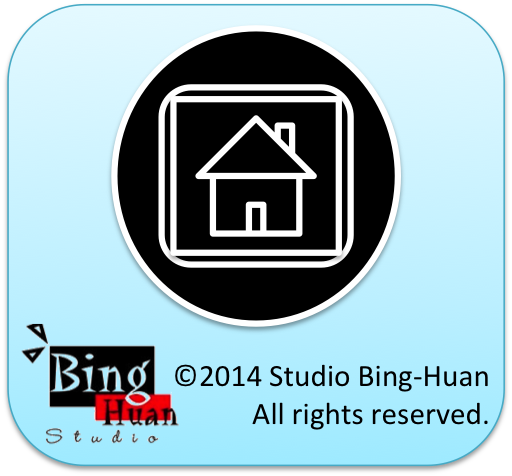

iOS_BH_HomeLauncher
===================
<br/>

## Description

iOS BH Home Launcher is a utility app for iPhone and iPod Touch that provides a quick way to return to the home screen. This app demonstrates an interesting approach to iOS app termination using local notifications to create a "launcher" effect.

## Features

- **Quick Home Access**: Provides an instant way to return to the iOS home screen
- **Local Notification Integration**: Uses iOS local notifications to alert users
- **Simple Interface**: Clean, minimalist design with a home button interface
- **Auto-termination**: The app automatically exits to return users to the home screen
- **Universal Support**: Compatible with various iPhone screen sizes and orientations

## How It Works

The app implements a unique mechanism:

1. When launched, the app automatically schedules a local notification
2. The app then terminates itself using `exit(0)`
3. A local notification appears with the message "Press me to the Home screen"
4. This creates a launcher-like experience for quickly accessing the home screen

## Technical Details

- **Language**: Objective-C
- **Framework**: UIKit
- **Target**: iOS (iPhone/iPod Touch)
- **Version**: 1.01 (Build 20120316)
- **Bundle ID**: com.binghuan.HomeLuancher
- **Minimum iOS**: iOS 5.0+

## Project Structure

```
HomeLuancher/
├── HomeAppDelegate.h/m          # Main app delegate
├── HomeViewController.h/m       # Main view controller
├── HomeLuancher-Info.plist     # App configuration
├── MainStoryboard.storyboard   # UI layout
└── homebutton.png              # Home button image asset
```

## Key Components

### HomeViewController
- Manages the main interface and home button functionality
- Implements `returnToHomeScreen:` action method
- Handles local notification scheduling and app termination

### HomeAppDelegate
- Registers for local and remote notifications
- Handles application lifecycle events
- Manages notification reception and processing

## Installation & Usage

1. Clone the repository
2. Open `HomeLuancher.xcodeproj` in Xcode
3. Build and run on your iOS device or simulator
4. Tap the home button interface to trigger the home screen return

## Author Information

<p>
	My Blog: <a href="http://studiobinghuan.blogspot.tw/?view=flipcard">http://studiobinghuan.blogspot.tw/?view=flipcard</a><br>
	or <a href="http://bhtalk.blogspot.tw/">http://bhtalk.blogspot.tw/</a>
	<br>
	<p>Link for this product:</p>
	<a href="http://studiobinghuan.blogspot.tw/2012/03/home-launcher-for-iphone-ipod-touch.html">http://studiobinghuan.blogspot.tw/2012/03/home-launcher-for-iphone-ipod-touch.html</a>
</p>

## Note

This project was created in 2012 as an experimental iOS utility. Modern iOS versions may have different behaviors regarding app termination and local notifications due to iOS security and policy changes.